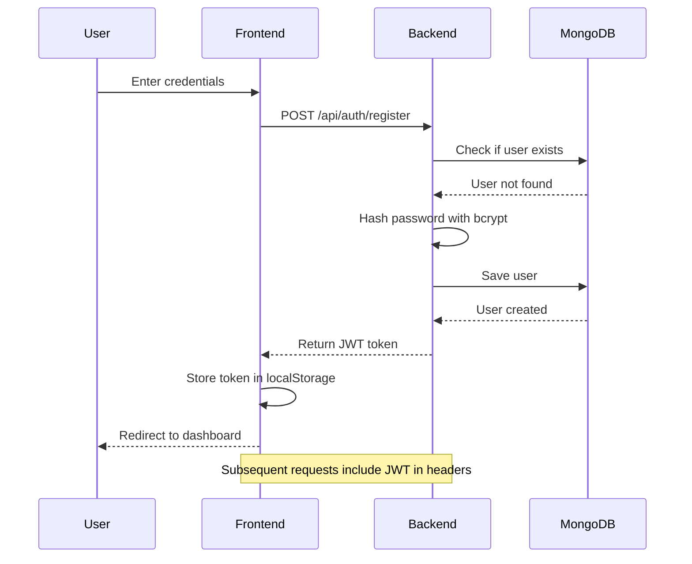

## 🚀 SmartAI Hub - Professional README.md

```markdown
# 🚀 SmartAI Hub - AI-Powered SaaS Platform

[](https://reactjs.org/)
[](https://vitejs.dev/)
[](https://tailwindcss.com/)
[](https://nodejs.org/)
[](https://expressjs.com/)
[](https://mongodb.com/)
[](LICENSE)

A **production-ready, full-stack AI SaaS platform** built with the MERN stack, featuring multiple AI tools, user authentication, and a credit-based usage system. The platform delivers a modern, responsive, and animated user experience with real-time notifications and smooth interactions.


---

## 📌 Table of Contents

- [✨ Features](#-features)
- [🎨 UI/UX Highlights](#-uiux-highlights)
- [🏗️ Architecture](#️-architecture)
- [⚙️ Tech Stack](#️-tech-stack)
- [📁 Project Structure](#-project-structure)
- [🚀 Installation](#-installation)
- [🔐 Authentication Flow](#-authentication-flow)
- [💰 Credit System](#-credit-system)
- [🤖 AI Tools](#-ai-tools)
- [📡 API Endpoints](#-api-endpoints)
- [🎯 Performance Optimizations](#-performance-optimizations)
- [🚧 Future Improvements](#-future-improvements)
- [🤝 Contributing](#-contributing)
- [📄 License](#-license)
- [👨‍💻 Author](#-author)

---

## ✨ Features

### 🤖 AI-Powered Tools

| Tool | Description | Technology |
|------|-------------|------------|
| **AI Chat** | Interactive conversational AI with markdown support | OpenAI/Gemini API |
| **Image Generator** | Create stunning images from text prompts | Hugging Face Stable Diffusion |
| **Resume Analyzer** | Upload PDF and get AI-powered feedback | PDF Parsing + AI Analysis |
| **Notes Summarizer** | Convert long notes into concise summaries | NLP Summarization |

### 🔐 Authentication & Security

- ✅ JWT-based authentication
- ✅ Password hashing with bcryptjs
- ✅ Protected API routes with middleware
- ✅ Session management via localStorage
- ✅ Form validation with real-time feedback

### 💰 Credit System

- ✅ 20 free credits for new users
- ✅ 1 credit deducted per AI request
- ✅ Real-time credit updates
- ✅ Low credit warning notifications
- ✅ Access denied when credits ≤ 0

### 🎨 Modern UI/UX

- ✅ **Glassmorphism Design** - Modern translucent effects
- ✅ **Smooth Animations** - Framer Motion powered transitions
- ✅ **Toast Notifications** - Real-time feedback with react-hot-toast
- ✅ **Loading Skeletons** - Better perceived performance
- ✅ **Empty States** - User-friendly guidance
- ✅ **Hover Effects** - Interactive card animations

### 📱 Fully Responsive

- ✅ Mobile-first approach
- ✅ Hamburger menu for mobile navigation
- ✅ Adaptive layouts for tablet & desktop
- ✅ Touch-friendly interactions
- ✅ Optimized spacing for all screen sizes

### 📊 Data Management

- ✅ MongoDB for persistent storage
- ✅ User-specific data isolation
- ✅ Chat & notes history
- ✅ Resume analysis history
- ✅ Image generation history (localStorage)

---

## 🎨 UI/UX Highlights

### Dashboard
- **Welcome Banner** - Personalized greeting with user name
- **Stats Cards** - Real-time credits and usage statistics
- **Quick Actions** - One-click access to all AI tools
- **Recent Activity** - Latest user interactions
- **Pro Tips** - Helpful suggestions for better results
- **Credit Progress Bar** - Visual credit consumption indicator

### Chat Page
- **Message Animations** - Slide-in effects for user/AI messages
- **Typing Indicator** - Bouncing dots while AI responds
- **Copy to Clipboard** - One-click copy with toast feedback
- **Chat History** - Sidebar with all previous conversations
- **Markdown Support** - Rich text formatting in responses
- **Responsive Sidebar** - Collapsible on mobile devices

### Notes & Resume Pages
- **Drag & Drop Upload** - Easy file selection
- **History Sidebar** - Access previous analyses
- **Copy Functionality** - Quick copy of summaries
- **Loading States** - Spinners and skeletons
- **Error Handling** - Graceful error messages

### Authentication Pages
- **Glassmorphism Cards** - Modern login/register forms
- **Password Validation** - Real-time validation feedback
- **Enter Key Support** - Quick form submission
- **Demo Credentials** - Easy testing access

---

## 🏗️ Architecture

```
┌─────────────────────────────────────────────────────────────┐
│                        Frontend (React)                      │
│  ┌─────────────┐ ┌─────────────┐ ┌─────────────────────┐   │
│  │  Dashboard  │ │    Chat     │ │  Notes/Resume/Image │   │
│  └─────────────┘ └─────────────┘ └─────────────────────┘   │
│         │               │                    │              │
│         └───────────────┼────────────────────┘              │
│                         ▼                                   │
│              ┌─────────────────────┐                        │
│              │   API Service Layer  │                       │
│              │     (Axios + JWT)    │                       │
│              └─────────────────────┘                        │
└──────────────────────────┬──────────────────────────────────┘
                           │ HTTP/HTTPS
                           ▼
┌─────────────────────────────────────────────────────────────┐
│                     Backend (Node.js)                        │
│  ┌─────────────────────────────────────────────────────┐   │
│  │              Express.js Application                   │   │
│  └─────────────────────────────────────────────────────┘   │
│         │               │                    │              │
│         ▼               ▼                    ▼              │
│  ┌─────────────┐ ┌─────────────┐ ┌─────────────────────┐   │
│  │ Controllers │ │ Middleware  │ │      Services       │   │
│  │ (Business   │ │   (Auth,    │ │ (AI APIs, Stripe)  │   │
│  │   Logic)    │ │   Upload)   │ │                     │   │
│  └─────────────┘ └─────────────┘ └─────────────────────┘   │
│         │               │                    │              │
│         └───────────────┼────────────────────┘              │
│                         ▼                                   │
│              ┌─────────────────────┐                        │
│              │   MongoDB Database   │                       │
│              │  (Mongoose ORM)     │                       │
│              └─────────────────────┘                        │
└─────────────────────────────────────────────────────────────┘
```

---

## ⚙️ Tech Stack

### Frontend
| Technology | Purpose |
|------------|---------|
| **React 18** | UI Library |
| **Vite** | Build Tool & Dev Server |
| **Tailwind CSS** | Utility-first CSS Framework |
| **Framer Motion** | Advanced Animations |
| **React Hot Toast** | Toast Notifications |
| **React Icons** | Icon Library |
| **React Markdown** | Markdown Rendering |
| **Axios** | HTTP Client |

### Backend
| Technology | Purpose |
|------------|---------|
| **Node.js** | Runtime Environment |
| **Express.js** | Web Framework |
| **MongoDB** | NoSQL Database |
| **Mongoose** | ODM for MongoDB |
| **JWT** | Authentication |
| **bcryptjs** | Password Hashing |
| **Multer** | File Upload Handling |
| **PDF Parse** | PDF Text Extraction |

### AI APIs
| Service | Purpose |
|---------|---------|
| **OpenAI/Gemini API** | Text Generation & Chat |
| **Hugging Face API** | Image Generation (Stable Diffusion) |
| **Custom Prompts** | Resume Analysis & Summarization |

---

## 📁 Project Structure

```
smart-ai-hub/
│
├── backend/
│   └── server/
│       ├── config/
│       │   └── db.js                    # MongoDB connection
│       ├── controllers/
│       │   ├── authController.js        # Authentication logic
│       │   ├── chatController.js        # Chat AI logic
│       │   ├── imageController.js       # Image generation
│       │   ├── notesController.js       # Notes summarization
│       │   ├── resumeController.js      # Resume analysis
│       │   └── dashboardController.js   # Dashboard stats
│       ├── middleware/
│       │   └── authMiddleware.js        # JWT verification
│       ├── models/
│       │   ├── User.js                  # User schema
│       │   ├── Chat.js                  # Chat history schema
│       │   ├── Notes.js                 # Notes history schema
│       │   └── Resume.js                # Resume history schema
│       ├── routes/
│       │   ├── authRoutes.js            # Auth endpoints
│       │   ├── chatRoutes.js            # Chat endpoints
│       │   ├── imageRoutes.js           # Image endpoints
│       │   ├── notesRoutes.js           # Notes endpoints
│       │   ├── resumeRoutes.js          # Resume endpoints
│       │   └── dashboardRoutes.js       # Dashboard endpoints
│       ├── services/
│       │   ├── openaiService.js         # AI API integration
│       │   └── stripeService.js         # Payment integration
│       ├── uploads/                     # PDF file storage
│       ├── utils/
│       │   └── creditHelper.js          # Credit management
│       ├── .env                         # Environment variables
│       ├── package.json
│       └── server.js                    # Entry point
│
├── frontend/
│   └── client/
│       ├── public/
│       ├── src/
│       │   ├── components/
│       │   │   ├── layout/
│       │   │   │   ├── Navbar.jsx       # Navigation bar
│       │   │   │   └── Sidebar.jsx      # Sidebar with history
│       │   │   ├── common/
│       │   │   │   ├── LoadingSkeleton.jsx
│       │   │   │   └── EmptyState.jsx
│       │   │   └── animations/
│       │   │       └── FadeIn.jsx
│       │   ├── pages/
│       │   │   ├── Dashboard.jsx        # Main dashboard
│       │   │   ├── Chat.jsx             # AI Chat page
│       │   │   ├── Notes.jsx            # Notes Summarizer
│       │   │   ├── Resume.jsx           # Resume Analyzer
│       │   │   ├── ImageGen.jsx         # Image Generator
│       │   │   ├── Login.jsx            # Login page
│       │   │   └── Register.jsx         # Registration page
│       │   ├── context/
│       │   │   └── AuthContext.jsx      # Auth state management
│       │   ├── services/
│       │   │   └── api.js               # Centralized API calls
│       │   ├── App.jsx                  # Root component
│       │   ├── main.jsx                 # Entry point
│       │   └── index.css                # Global styles
│       ├── .env
│       ├── package.json
│       └── vite.config.js
│
├── .gitignore
└── README.md
```

---

## 🚀 Installation

### Prerequisites

- Node.js (v18 or higher)
- MongoDB (local or Atlas)
- npm or yarn

### 1️⃣ Clone the Repository

```bash
git clone https://github.com/your-username/smart-ai-hub.git
cd smart-ai-hub
```

### 2️⃣ Backend Setup

```bash
cd backend/server
npm install
```

#### Create `.env` file

```env
PORT=5000
MONGO_URI=mongodb://localhost:27017/smartaihub
JWT_SECRET=your_super_secret_key_change_this
HUGGINGFACE_API_KEY=your_huggingface_api_key
OPENAI_API_KEY=your_openai_api_key
NODE_ENV=development
```

#### Start Backend Server

```bash
npm run dev
# or
npm start
```

Server will run on `http://localhost:5000`

### 3️⃣ Frontend Setup

```bash
cd frontend/client
npm install
```

#### Create `.env` file

```env
VITE_API_URL=http://localhost:5000/api
```

#### Start Frontend Development Server

```bash
npm run dev
```

Application will run on `http://localhost:5173`

---

## 🔐 Authentication Flow



---

## 💰 Credit System

```
┌─────────────────────────────────────────────────────────┐
│                    Credit System Flow                    │
├─────────────────────────────────────────────────────────┤
│                                                          │
│  1. New User Registration                                │
│     └─> Initial Credits: 20                             │
│                                                          │
│  2. User Makes AI Request                                │
│     └─> Check Credits > 0?                              │
│         ├─> YES: Process request, deduct 1 credit       │
│         └─> NO: Return 403 "No credits remaining"       │
│                                                          │
│  3. Credit Update                                        │
│     └─> Real-time update in frontend                    │
│     └─> Toast notification for low credits (<5)          │
│                                                          │
└─────────────────────────────────────────────────────────┘
```

### Credit Deduction per Tool

| Tool | Credits Deducted |
|------|------------------|
| AI Chat | 1 credit per message |
| Image Generator | 1 credit per image |
| Notes Summarizer | 1 credit per summary |
| Resume Analyzer | 2 credits per analysis |

---

## 🤖 AI Tools

### 1. AI Chat
- **Endpoint:** `POST /api/chat`
- **Features:** Markdown support, conversation history, copy to clipboard
- **Response:** AI-generated text response

### 2. Image Generator
- **Endpoint:** `POST /api/image`
- **Model:** Stable Diffusion via Hugging Face
- **Response:** Base64 encoded image
- **History:** Stored in localStorage (last 5 images)

### 3. Resume Analyzer
- **Endpoint:** `POST /api/resume/analyze`
- **Input:** PDF file upload
- **Process:** Extract text → AI analysis → Structured feedback
- **Response:** Detailed resume review with suggestions

### 4. Notes Summarizer
- **Endpoint:** `POST /api/notes/summarize`
- **Input:** Long text notes
- **Response:** Concise AI-generated summary
- **History:** Stored in MongoDB

---

## 📡 API Endpoints

### Authentication
| Method | Endpoint | Description |
|--------|----------|-------------|
| POST | `/api/auth/register` | Register new user |
| POST | `/api/auth/login` | Login user |
| GET | `/api/auth/me` | Get current user |

### AI Tools
| Method | Endpoint | Description |
|--------|----------|-------------|
| POST | `/api/chat` | Send chat message |
| POST | `/api/image` | Generate image |
| POST | `/api/notes/summarize` | Summarize notes |
| GET | `/api/notes` | Get notes history |
| POST | `/api/resume/analyze` | Analyze resume |
| GET | `/api/resume` | Get resume history |

### Dashboard
| Method | Endpoint | Description |
|--------|----------|-------------|
| GET | `/api/dashboard` | Get user stats |

---

## 🎯 Performance Optimizations

### Frontend
- ✅ Lazy loading for images
- ✅ Debounced API calls
- ✅ Local storage caching for history
- ✅ Optimized re-renders with React hooks
- ✅ Code splitting with Vite

### Backend
- ✅ Database indexing for queries
- ✅ Request rate limiting
- ✅ File size limits for uploads
- ✅ Error handling middleware
- ✅ CORS configuration

---

## 🚧 Future Improvements

- [ ] **Payment Integration** - Stripe for credit purchases
- [ ] **Dark Mode** - Theme toggle with localStorage persistence
- [ ] **Real-time Chat** - WebSocket streaming responses
- [ ] **Voice Input** - Speech-to-text for chat
- [ ] **Export Feature** - PDF/Word export for notes & resumes
- [ ] **Share Feature** - Share chat/image with public link
- [ ] **Analytics Dashboard** - Usage graphs and insights
- [ ] **Email Notifications** - Credit low alerts via email
- [ ] **Social Login** - Google/GitHub OAuth
- [ ] **Mobile App** - React Native version

---

## 🤝 Contributing

Contributions are welcome! Please follow these steps:

1. Fork the repository
2. Create a feature branch: `git checkout -b feature/amazing-feature`
3. Commit changes: `git commit -m 'Add amazing feature'`
4. Push to branch: `git push origin feature/amazing-feature`
5. Open a Pull Request

### Development Guidelines
- Follow ESLint rules
- Write meaningful commit messages
- Update documentation as needed
- Test thoroughly before submitting

---

## 📄 License

This project is licensed under the MIT License - see the [LICENSE](LICENSE) file for details.

---

## 👨‍💻 Author

### **Rishikesh Pandey**
- 🚀 Full Stack Developer & AI Enthusiast
- 💼 Portfolio: https://rishikeshpandey.vercel.app
- 🐙 GitHub: https://github.com/Rishikespandey
- 📧 Email: sonupandey5705@gmail.com

---

## 🙏 Acknowledgments

- [OpenAI](https://openai.com/) for GPT API
- [Hugging Face](https://huggingface.co/) for Stable Diffusion
- [Tailwind CSS](https://tailwindcss.com/) for amazing styling
- [Framer Motion](https://www.framer.com/motion/) for smooth animations
- [React Hot Toast](https://react-hot-toast.com/) for beautiful notifications

---

## ⭐ Show Your Support

If you found this project helpful, please give it a ⭐ on GitHub!

---

**Built with ❤️ by Rishikesh Pandey** | © 2024 SmartAI Hub

```